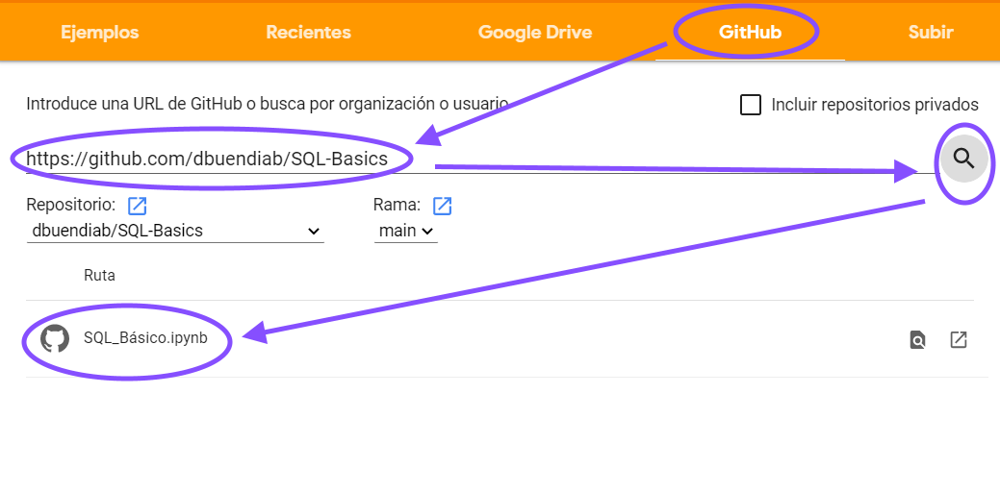

# SQL-Basics
Google Colab notebook para practicar SQL

## Formas de ejecución

El código fuente está en este [repositorio de **GitHub**](https://github.com/dbuendiab/SQL-Basics), y se puede ejecutar descargándolo de tres maneras distintas:
* **Google Colab**: es el entorno de ejecución de Notebooks de Google.
* **MyBinder**: es una web que permite clonar y ejecutar un proyecto de Notebooks directamente desde **GitHub**
* **git clone**: comando **git** para descargar el repositorio GitHub en una máquina local.

### Google Colab

El notebook se creó originalmente en [Google Colab](https://colab.research.google.com/notebooks/intro.ipynb), así que ejecutarlo aquí proporciona la mejor visualización posible.  

Puedes abrir una copia en **Google Colab** mediante la opción de menú **Archivo - Abrir cuaderno - GitHub** y poniendo en el formulario **"https://github.com/dbuendiab/SQL-Basics"**. 



El único inconveniente de este método es que **Google Colab** descarga exclusivamente el notebook, y no el resto de ficheros del proyecto. Esto es un problema porque la base de datos **covid.db** no se descarga automáticamente, a pesar de ser imprescindible para el funcionamiento del notebook. Para importarla, hay que ejecutar la celda del notebook habilitada al respecto.

### MyBinder

[Binder](https://mybinder.org/) es una web que crea una versión online de un notebook a partir del repositorio **GitHub** correspondiente. Sólo hay que acceder a la URL https://mybinder.org/v2/gh/dbuendiab/sql-basics/main y ya se accede directamente a la página principal del repositorio clonado.

**MyBinder** copia todo el proyecto, incluida la base de datos *covid.db*. En contrapartida, la versión de **Jupyter Notebooks** es ligeramente diferente y no incluye toda la funcionalidad de visualización (falta la opción de celdas ocultas, básicamente).

### git clone

Para descargar en local el repositorio, hay que tener instalado un cliente **git** (si no, se puede bajar en formato .zip y descomprimir en un directorio local).

Copia el repositorio en un directorio local con 
```
git clone https://github.com/dbuendiab/SQL-Basics.git
```
Debe haber un Python >= 3.5 instalado. Los requisitos son **jupyterlab** (para el notebook) y **prettytable** (para el formato de tablas).

